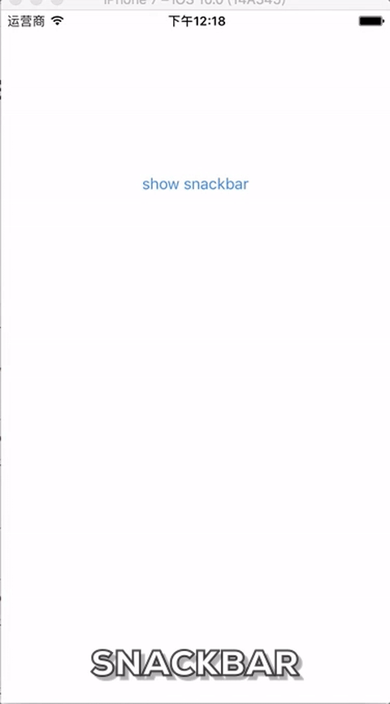

# CYSnackbar
## Description

Snackbar on iOS, written by Swift 3.



## Usage

```swift
CYSnackbar.make(text: "This is a snackbar", duration: .short).show() // Show a short snackbar
// Show a snackbar with button
CYSnackbar
	.make(text: "This is a snackbar", duration: .short)
    .action(with: "OK", action: { (sender) in        
    	NSLog("snackbar clicked")
    })
    .show()
// Dismiss Handler get called when the snackbar is automatically dismissed.
CYSnackbar
    .make(text: "this is a snackbar", duration: .long)
    .action(with: "OK", action: { (sender) in
        NSLog("snackbar clicked")
    })
    .dismissHandler {
        NSLog("snackbar dismissed")
    }
    .show()
```


## Install

* **Install from Cocoa pods**

  Add this line to your Podfile: `pod 'CYSnackbar', '0.1-alpha'`, don't forget to add use_frameworks!

  Your Podfile would look like this:

  ```
  # Uncomment the next line to define a global platform for your project
  # platform :ios, '9.0'

  target 'TargetName' do
    # Comment the next line if you're not using Swift and don't want to use dynamic frameworks
    use_frameworks!

    # Pods for Touches
  pod 'CYSnackbar', '~> 0.1-alpha'
  end
  ```

  ​

* **Or just clone this repository, add source file to your project.**

  `git clone https://github.com/chaoyang805/CYSnackbar.git`


